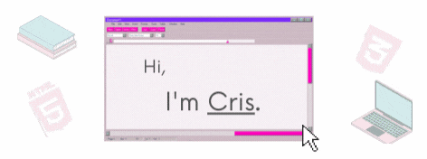

## About me
- 🎓 Bachelor's degree in Computer Engineering from [São Judas Tadeu University](https://www.usjt.br/).
- 💻 Currently learning HTML, CSS (SASS, Bootstrap) and JavaScript (JQuery, Node.js).
- 🗣 I speak Portuguese and English.
- 📌 São Paulo, Brazil

## Skills and Tools
           

## Github Stats

