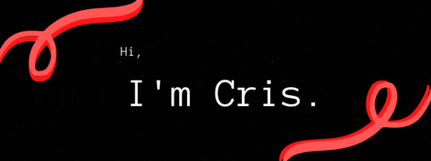

## About me
- 🎓 I'm studying computer engineering at [USJT](https://www.usjt.br/).
- 💕 I’m interested in Web Development.
- 💻 I’m currently learning HTML, CSS and JavaScript.
- 🗣 I speak Portuguese and English.
- 🎎 I'm learning Japanese.
- 📌 São Paulo, Brazil

## Skills and Tools
           

## Github Stats
